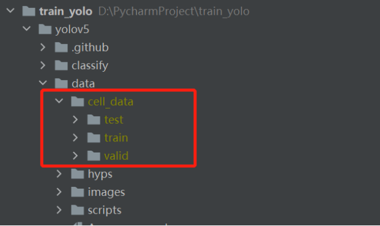
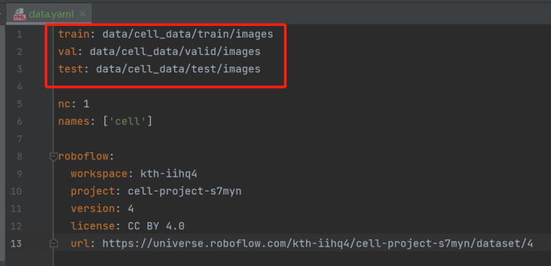

# Cell_detection_tracking

### This is a research project aiming to extract information (position, state) and tracking from cell Brightfield images.

Note: the whole dataset is not allowed to be published

#### Work
- Labeled data with position through Robotflow, convert it to 

- Retrained Yolov5 model with our customed dataset

- Manually create a folder in separation with cells with G,M,S states. After that, Designed and implemented a Convolutional Neural Network (CNN) based cell state estimation model.

- Implemented Hungarian algorithm to do data association.
- Implemented Kalman filter for cell tracking.

#### How to train new Yolov5.pt
1. `git clone https://github.com/ultralytics/yolov5.git` to local machine
2. Download our labelled cell dataset(https://app.roboflow.com/ds/JGfOg5LA0C?key=HhzTKntSLt), create a folder and put train, test, val images and its labelling file like this

3. Put the `data.yaml` file in the yolov5 project under data catalog, modify the path of train, val, test to align with actual path.

4. Configure pytorch environment. run `配置好 pytorch 环境，运行命令
python yolov5/train.py --img 1388 --batch (4) --epochs (10) --data 
(yolov5/data/data.yaml) --cfg yolov5/models/yolov5s.yaml --weights 
(./yolov5/yolov5s.pt) --name (train1)`.

Note: Because we didn't train the model from scratch and used the pretrained yolov5 model weights, yolov5s.pt should be copyed the under this project.

#### Tracking algorithm
kalman filter
The noise-driven complete version is in position_kf.py file
In practical, we implemented a two-frame kalman filter, where the input is the observations of the current frame and the prediction of the current frame from last frame. The return is the prediction xHat and the covariance martrix.

#### Data association
Hungarian algorithm

The detail is in the report.pdf

The animation of our cell detection and tracking result is in animation.mp4 file.